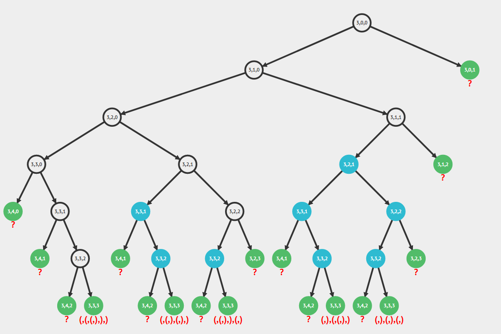

# [22. Generate Parentheses](https://leetcode.com/problems/generate-parentheses/)

## Description

Given n pairs of parentheses, write a function to generate all combinations of well-formed parentheses.

For example, given n = 3, a solution set is:

```example
[
  "((()))",
  "(()())",
  "(())()",
  "()(())",
  "()()()"
]
```


## Solution
Use a binary tree to represent the combinations of parentheses.
left child is '(', and right child is ')'. By the picture below, you would find that when we creat and traverse this recursion tree, all the path to leaves are answers.


(reference from [AtonNS](https://leetcode.com/problems/generate-parentheses/discuss/508114/Best-backtracking-explanation-(pictures)-and-c%2B%2B-code))

## Summary
This problem is more difficult than expected for me. I thought that I had grasped the key idea of recursion, but didn't find a good way to translate it to real code. It's so ingenious to represent it to a binary tree, which is completely beyond my expectation. I've learnt a valuable lesson from this problem, and the guy who figure out this way.
