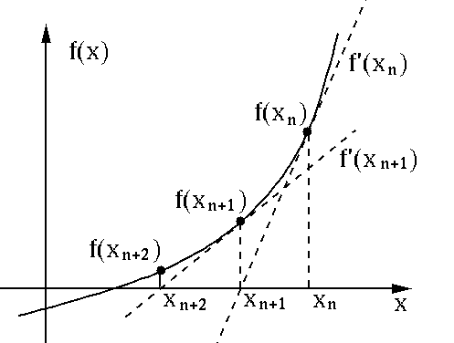

# [69. Sqrt(x)](https://leetcode.com/problems/sqrtx/)

## Description

<div class="content__u3I1 question-content__JfgR"><div><p>Implement <code>int sqrt(int x)</code>.</p>

<p>Compute and return the square root of <em>x</em>, where&nbsp;<em>x</em>&nbsp;is guaranteed to be a non-negative integer.</p>

<p>Since the return type&nbsp;is an integer, the decimal digits are truncated and only the integer part of the result&nbsp;is returned.</p>

<p><strong>Example 1:</strong></p>

<pre><strong>Input:</strong> 4
<strong>Output:</strong> 2
</pre>

<p><strong>Example 2:</strong></p>

<pre><strong>Input:</strong> 8
<strong>Output:</strong> 2
<strong>Explanation:</strong> The square root of 8 is 2.82842..., and since
&nbsp;            the decimal part is truncated, 2 is returned.
</pre>
</div></div>

## Solution
This is an interesting question. There are mainly three ways to solve it.
1. Binary search:
    * Try the number between mid and right or left and mid, just think about binary search algorithm.
    * Intuitive but time-consuming.
2. [Long Division Algorithm](http://euler.tn.edu.tw/think102.htm):
    * A good method with hand calculation
    * Not suitable for computer.
3. Newton-Raphson method:
    * An approximation method with recursive form.
    * Fast and easy to implement.

Let me simply explain how Newton-Raphson method works, please see the figure below:


The key idea is `tangent line`. Each tangent line lead us to relocate a more precise. Let's see an example.
If we want to find the square root of _a_, then we can define a function :
```
    f(x) = x^2 - a
```
The root of **_f(x)_** is the square of _a_.
After that, we can try figure out the recursive relation.
* First iteration: `X0,f(X0)`
* Second iteration: `X0-f(X0)/f'(X0),f(X0-f(X0)/f'(X0))`
* Third iteration: try yourself.

So, we can define the recursive form:
```
X(n) = X(n-1) - f(X(n-1))/f'(X(n-1))
```
We can easily find that the differential of _f(x)_ should be _2x_. That's reformulate it:
```
X(n) = X(n-1) - f(X(n-1))/2(X(n-1))
```    
Now, we can use this magical formula and choose a starting number to calculate the square root of the number. But you need to be careful about the `overflow` problem. So the maximum starting number is `46340` which is the square root of `MAX_INT`(2147483647).

_**Time complexity: O(log(n))**_

## Summary
Actually, the time complexity of this algorithm is not exactly _O(log(n))_. You can see [this page](https://math.stackexchange.com/questions/1865688/what-is-the-computational-complexity-of-newton-raphson-method-to-find-square-roo) for more details.
