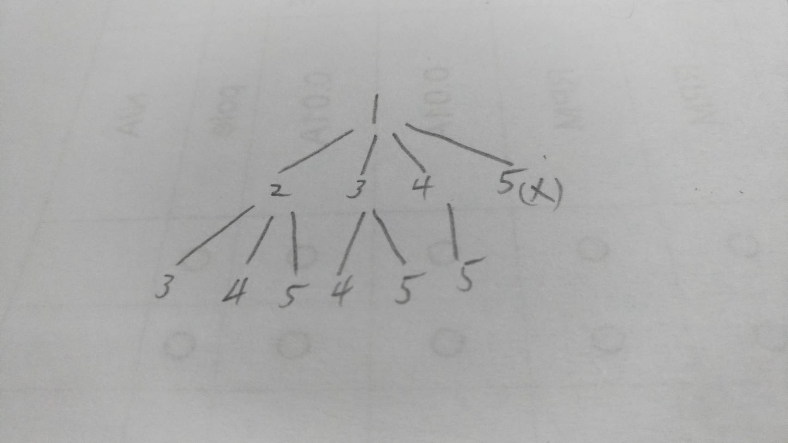

# [77. Combinations](https://leetcode.com/problems/combinations/)

## Description

Given two integers <em>n</em> and <em>k</em>, return all possible combinations of <em>k</em> numbers out of 1 ... <em>n</em>.

<strong>Example:</strong>

<pre><strong>Input:</strong>&nbsp;n = 4, k = 2
<strong>Output:</strong>
[
  [2,4],
  [3,4],
  [2,3],
  [1,2],
  [1,3],
  [1,4],
]
</pre>

## Solution
I use recursion to find all the combinations. Just see the tree diagram below:

* It's a example of n=5, k=3, and the starting value is `1`.

Each child node has a value that is not greater than it's parent node's. If the length of path from root to leaf is equal to `k`, it's a valid combination. Notice that if **n - current node value is less than k - current node height**, it is impossible for this path to generate the valid combination, so we use this heuristic to avoid wasting time.

_**Time complexity: O(combination(n,k))**_

## Summary
The `heuristic` I mentioned above is very helpful. The original method without the heuristic taked **120 ms** to pass the test, however, with the help of heuristic, it only taked **20 ms**. What a great improvement!
