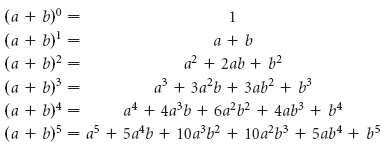

# [119. Pascal's Triangle II](https://leetcode.com/problems/pascals-triangle-ii/)

## Description

<div class="content__u3I1 question-content__JfgR"><div><p>Given an integer <code>rowIndex</code>, return the <code>rowIndex<sup>th</sup></code>&nbsp;row of the Pascal's triangle.</p>

<p>Notice&nbsp;that the row index starts from&nbsp;<strong>0</strong>.</p>

<p><br>
<small>In Pascal's triangle, each number is the sum of the two numbers directly above it.</small></p>

<p><strong>Follow up:</strong></p>

<p>Could you optimize your algorithm to use only <em>O</em>(<em>k</em>) extra space?</p>

<p>&nbsp;</p>
<p><strong>Example 1:</strong></p>
<pre><strong>Input:</strong> rowIndex = 3
<strong>Output:</strong> [1,3,3,1]
</pre><p><strong>Example 2:</strong></p>
<pre><strong>Input:</strong> rowIndex = 0
<strong>Output:</strong> [1]
</pre><p><strong>Example 3:</strong></p>
<pre><strong>Input:</strong> rowIndex = 1
<strong>Output:</strong> [1,1]
</pre>
<p>&nbsp;</p>
<p><strong>Constraints:</strong></p>

<ul>
	<li><code>0 &lt;=&nbsp;rowIndex &lt;= 40</code></li>
</ul>
</div></div>

## Solution
At first, I write a recursive function to generate the target row element. But it's time-consuming and waste a lot of spaces. So here comes the iteration. At the _i-th_ iteration in the outer for loop, it represents the row elements for rowIndex = _i_. Just see the figure below:

**rowIndex = 4**
* Initialize the array(length = rowIndex+1) with zero, and make the first one element `1`.

    |1|0|0|0|0|
    |-|-|-|-|-|

* Iteration i=1, the first two elements represent row of rowIndex = 1
    |1|1|0|0|0|
    |-|-|-|-|-|

* Iteration i=2, the first three elements represent row of rowIndex = 2
    |1|2|1|0|0|
    |-|-|-|-|-|

* Iteration i=3, the four three elements represent row of rowIndex = 3
    |1|3|3|1|0|
    |-|-|-|-|-|

* Iteration i=4, the whole array represent row of rowIndex = 4
    |1|4|6|4|1|
    |-|-|-|-|-|

_**Time complexity: O(n^2)**_

## Summary
Actually, this problem can be solved in _**O(n)**_ time complexity. Because the Pascal's triangle is based on the binomial theorem.
.
As a result, we can directly calculate the combination at each term. But it may easily cause overflow, so we need `long` type variable to store it.
```c++
vector<int> getRow(int rowIndex) {
    vector<int> ans(rowIndex+1,1);
    int small = rowIndex/2;
    long comb = 1;
    int j = 1;
    for (int i=rowIndex; i>=small; i--){
        comb *= i;
        comb /= j;
        j ++;
        ans[i-1] = (int)comb;
        ans[j-1] = (int)comb;
    }
    return ans;
}
```
