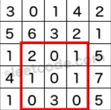

# [304. Range Sum Query 2D - Immutable](https://leetcode.com/problems/range-sum-query-2d-immutable/)
## Description
<div><p>Given a 2D matrix <i>matrix</i>, find the sum of the elements inside the rectangle defined by its upper left corner (<i>row</i>1, <i>col</i>1) and lower right corner (<i>row</i>2, <i>col</i>2).</p>



<small>The above rectangle (with the red border) is defined by (row1, col1) = <b>(2, 1)</b> and (row2, col2) = <b>(4, 3)</b>, which contains sum = <b>8</b>.</small>
</p>

<p><b>Example:</b><br>
</p><pre>Given matrix = [
  [3, 0, 1, 4, 2],
  [5, 6, 3, 2, 1],
  [1, 2, 0, 1, 5],
  [4, 1, 0, 1, 7],
  [1, 0, 3, 0, 5]
]

sumRegion(2, 1, 4, 3) -&gt; 8
sumRegion(1, 1, 2, 2) -&gt; 11
sumRegion(1, 2, 2, 4) -&gt; 12
</pre>
<p></p>

<p><b>Note:</b><br>
</p><ol>
<li>You may assume that the matrix does not change.</li>
<li>There are many calls to <i>sumRegion</i> function.</li>
<li>You may assume that <i>row</i>1 ≤ <i>row</i>2 and <i>col</i>1 ≤ <i>col</i>2.</li>
</ol>
<p></p></div></div>

## Solution
Construct a table `dp[0....n,0...n]`, where `dp[i,j]` represet the summation from of `matrix[a,b]`, for `a <= i, b <= j`. After all things have been done(it takes _**O(n*m)**_), we can calculate any rectangle region in the matrix in _**O(4)**_ = _**O(1)**_. Just see the idea below:
```cpp
                    +-------------+     +-----+           +------------+     +-----+
                    |             |     |     |           |            |     |     |
                    |             |     |     |           |            |     |     |
       +------+  =  |             |  -  |     |        -  +------------+  +  +-----+  
       |      |     |             |     |     |
       |      |     |             |     |     |
       +------+     +-------------+     +-----+
  SR(i1,j1,i2,j2) =     dp[i2,j2]    -  dp[i2,j1]      -   dp[i1,j2]      +  sp[i1,j1]
```

_**Time complexity: O(n*m)**_

## Summary
Interesting problem.
